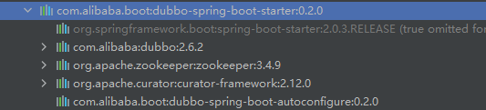

# Dubbo

## 1、Dubbo概念与架构

* **分布式基础理论**

  分布式系统是若干个独立计算机的集合，但这些计算机对于用户而言似乎是一个单个相关的系统。

* **服务发现**

  消费端自动发现服务地址列表，基于自动化的服务发现，微服务可以无需知道各自的端口号以及IP地址而进行通信。服务发现需要有一个注册中心，选择Zookeeper。
  
  Dubbo3 与 Dubbo2 的服务发现配置是完全一致的，不需要改动什么内容。但就实现原理上而言，Dubbo3 引入了全新的服务发现模型 - 应用级服务发现， 在工作原理、数据格式上已完全不能兼容老版本服务发现。
  
  - Dubbo3 应用级服务发现，以应用粒度组织地址数据
  - Dubbo2 接口级服务发现，以接口粒度组织地址数据
  
  

---


## 2、Dubbo+Springboot

* github地址

``` shell
git clone https://github.com/gityh2021/dubbo-pringboot.git
```

* maven配置：直接一个配置解决，dubbo-spring-boot-starter中包含多个包

``` xml
<dependency>
    <groupId>com.alibaba.boot</groupId>
    <artifactId>dubbo-spring-boot-starter</artifactId>
    <version>0.2.0</version>
</dependency>
```

所包含的包：dubbo是基本框架，zookeeper是注册中心，curator是一个客户端，以及dubbo自动配置



* 项目基本架构：画的挺清楚的了，就不赘述了


* 关键注解

  * 在启动类增加 @EnableDubbo注解

    ```java
    @SpringBootApplication
    @MapperScan(basePackages = {"com/example/mapper"})
    @EnableDubbo
    public class ServiceApp {
        public static void main(String[] args) {
            SpringApplication.run(ServiceApp.class, args);
        }
    }
    ```

    

  * consumer服务引用：这边的reference要引入dubbo中的reference

    ```java
    @Reference
    private DubboHandler dubboHandler;
    ```

  * provider服务注册：这边的service要引入dubbo中的service

    ```java
    @Service
    @Component
    public class DubboHandlerImpl implements DubboHandler {
        public String sayHello() {
            return "Hello, This is provider!";
        }
    }
    ```

---


## 3、Dubbo原理

