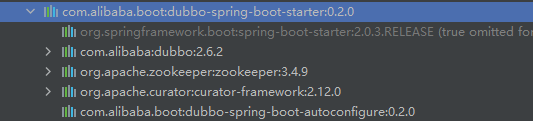

# Dubbo

## 1、Dubbo概念与架构

* **分布式基础理论**

  分布式系统是若干个独立计算机的集合，但这些计算机对于用户而言似乎是一个单个相关的系统。

* **服务发现**

  消费端自动发现服务地址列表，基于自动化的服务发现，微服务可以无需知道各自的端口号以及IP地址而进行通信。服务发现需要有一个注册中心，选择Zookeeper。
  
  Dubbo3 与 Dubbo2 的服务发现配置是完全一致的，不需要改动什么内容。但就实现原理上而言，Dubbo3 引入了全新的服务发现模型 - 应用级服务发现， 在工作原理、数据格式上已完全不能兼容老版本服务发现。
  
  - Dubbo3 应用级服务发现，以应用粒度组织地址数据
  - Dubbo2 接口级服务发现，以接口粒度组织地址数据
  
  

---


## 2、Dubbo+Springboot

* github地址

``` shell
git clone https://github.com/gityh2021/dubbo-pringboot.git
```

* maven配置：直接一个配置解决，dubbo-spring-boot-starter中包含多个包

``` xml
<dependency>
    <groupId>com.alibaba.boot</groupId>
    <artifactId>dubbo-spring-boot-starter</artifactId>
    <version>0.2.0</version>
</dependency>
```

所包含的包：dubbo是基本框架，zookeeper是注册中心，curator是一个客户端，以及dubbo自动配置



* 项目基本架构：画的挺清楚的了，就不赘述了


* 关键注解

  * 在启动类增加 @EnableDubbo注解

    ```java
    @SpringBootApplication
    @MapperScan(basePackages = {"com/example/mapper"})
    @EnableDubbo
    public class ServiceApp {
        public static void main(String[] args) {
            SpringApplication.run(ServiceApp.class, args);
        }
    }
    ```

    

  * consumer服务引用：这边的reference要引入dubbo中的reference

    ```java
    @Reference
    private DubboHandler dubboHandler;
    ```

  * provider服务注册：这边的service要引入dubbo中的service

    ```java
    @Service
    @Component
    public class DubboHandlerImpl implements DubboHandler {
        public String sayHello() {
            return "Hello, This is provider!";
        }
    }
    ```

---


## 3、Dubbo原理

* 服务概述

  互联网兴起之时，人们便致力于实现动态发现服务器地址的能力。首先DNS协议，通过域名来访问后端服务，代理组件会给予DNS地址解析后的地址列表，将流量合理分配到各个服务器上。基于SpringBoot+Eurake，以及Dubbo+zookeeper都是基于这个下图的框架实现的。

  

* Dubbo对于面向应用粒度的地址发现方案。

  **接口粒度：**

  每注册一个实例，在注册中心会产生一个节点。

  **应用粒度：**

  相同的应用只有一条实例数据，注册中心的数据量不再与接口数成正比，而是和应用成正比。

  **好处：**

  * 与业界主流微服务模型对齐，比如 SpringCloud、Kubernetes Native Service等。

  * 提升性能与可伸缩性。注册中心数据的重新组织（减少），能最大幅度的减轻注册中心的存储、推送压力，进而减少 Dubbo Consumer 侧的地址计算压力；集群规模也开始变得可预测、可评估（与 RPC 接口数量无关，只与实例部署规模相关）

  **自动化的实例地址发现**：

  Dubbo 通过注册中心同时同步了实例地址和 RPC 方法，因此其能实现 RPC 过程的自动同步，面向 RPC 编程、面向 RPC 治理，对后端应用的拆分消费端无感知，其缺点则是地址推送数量变大，和 RPC 方法成正比。

* 应用级服务发现工作原理

  

- 服务提供者启动，首先解析应用定义的“普通服务”并依次注册为 RPC 服务，紧接着注册内建的 MetadataService 服务，最后打开 TCP 监听端口。
- 启动完成后，将实例信息注册到注册中心（仅限 ip、port 等实例相关数据），提供者启动完成。
- 服务消费者启动，首先依据其要“消费的 provider 应用名”到注册中心查询地址列表，并完成订阅（以实现后续地址变更自动通知）。
- 消费端拿到地址列表后，紧接着对 MetadataService 发起调用，返回结果中包含了所有应用定义的“普通服务”及其相关配置信息。
- 至此，消费者可以接收外部流量，并对提供者发起 Dubbo RPC 调用
